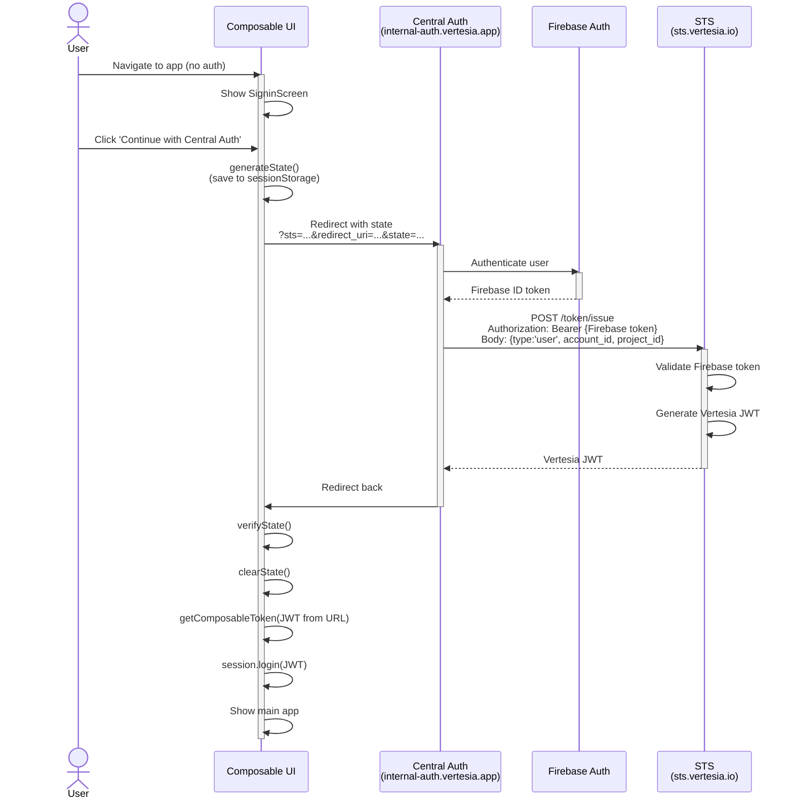
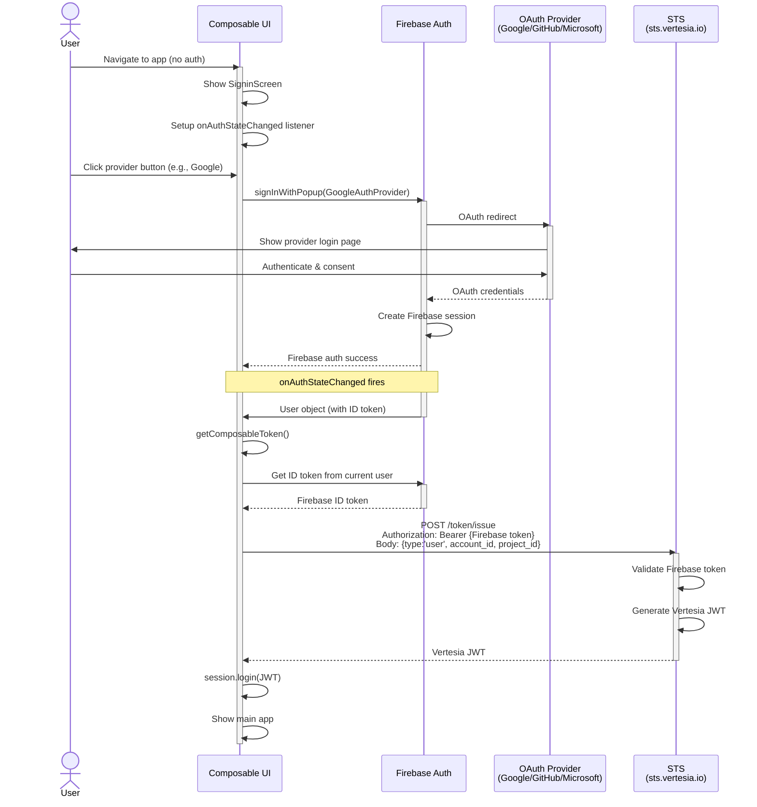
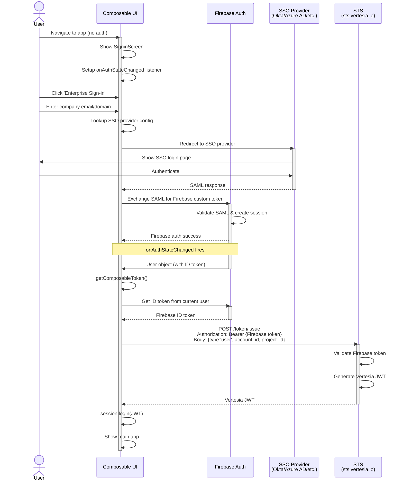
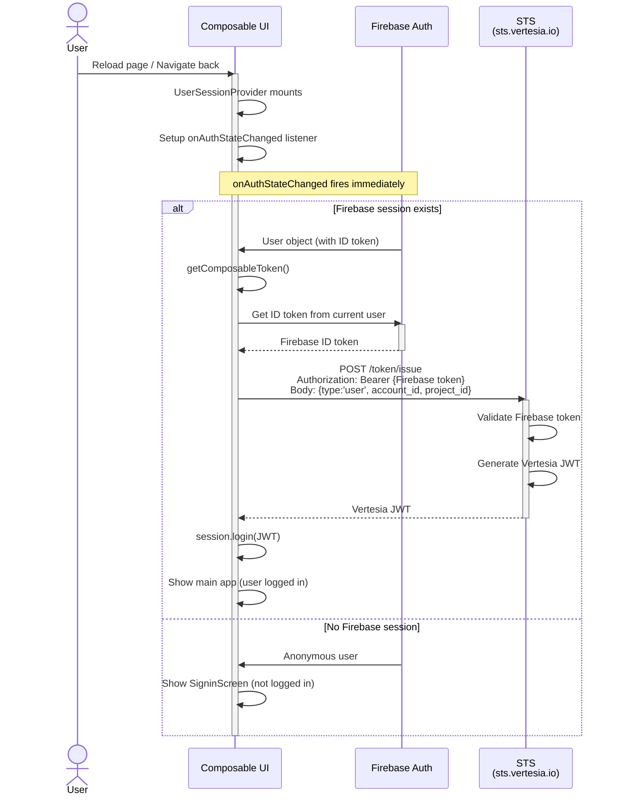
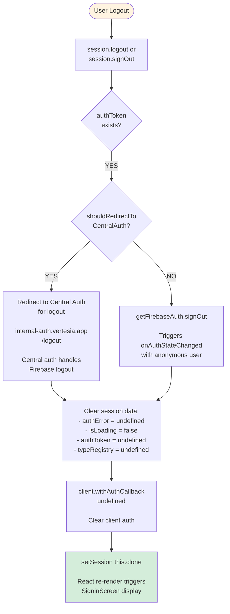
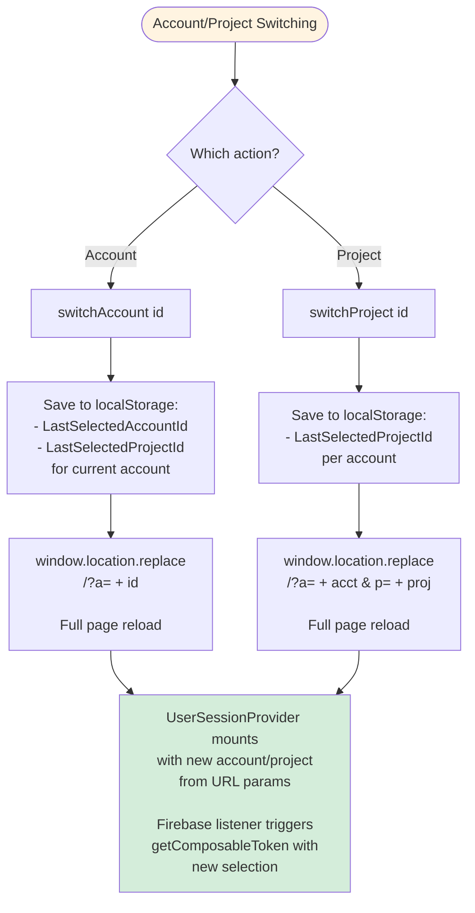

# User Authentication Flow

This document describes the authentication flow for the Vertesia user-facing applications.

## Overview

The authentication system uses:
- **Firebase** for identity management and OAuth provider integration
- **Central Auth** (internal-auth.vertesia.app) for centralized authentication flow
- **STS (Security Token Service)** (sts.vertesia.io) to validate Firebase tokens and generate Vertesia JWT tokens
- **Session state management** to validate redirects and prevent CSRF attacks

### STS Endpoints
- Production/Preview: `https://sts.vertesia.io`
- Staging: `https://sts-staging.vertesia.io`

**Important**: STS is the single source of truth for generating Vertesia JWT tokens. Both authentication paths (Central Auth and Direct Firebase) ultimately call STS to get the JWT.

## Key Components

- **UserSession** (UserSession.ts): Core session class managing auth state, client configuration, and user data
- **UserSessionProvider** (UserSessionProvider.tsx): React context provider orchestrating the auth flow
- **SigninScreen** (SigninScreen.tsx): UI component showing login options and handling signup

---

## Complete Authentication Flow

```
  ┌─────────────────────────────────────────────────────────────────────────────┐
  │                      APP LOADS (NO AUTHENTICATION)                           │
  └────────────────────────────────────────────┬────────────────────────────────┘
                                               │
                                               ▼
                              ┌─────────────────────────────┐
                              │ UserSessionProvider mounts  │
                              │                             │
                              │ 1. Parse URL hash:          │
                              │    token=..., state=...     │
                              │ 2. Get account/project from │
                              │    URL (?a=...&p=...) or    │
                              │    localStorage             │
                              │ 3. Clear URL hash           │
                              │ 4. Setup idempotency guard  │
                              │ 5. Create new UserSession   │
                              │    (authToken = undefined)  │
                              └──────────┬──────────────────┘
                                         │
                                         ▼
                              ┌─────────────────────────────┐
                              │ Has token & state in URL?   │
                              └─────┬───────────────┬───────┘
                                   YES              NO
                                    │               │
        ┌───────────────────────────┘               └───────────────────────────┐
        ▼                                                                       ▼
┌────────────────────┐                                            ┌────────────────────┐
│ ═══════════════════│                                            │ ═══════════════════│
│ PATH A: TOKEN FLOW │                                            │ PATH B: NO TOKEN   │
│ ═══════════════════│                                            │ ═══════════════════│
│                    │                                            │                    │
│ (Returning from    │                                            │ (First load or     │
│  central auth)     │                                            │  no URL token)     │
└────────┬───────────┘                                            └────────┬───────────┘
         │                                                                 │
         ▼                                                                 ▼
┌────────────────────┐                                            ┌────────────────────┐
│ verifyState()      │                                            │ Setup Firebase     │
└────┬───────────┬───┘                                            │ onAuthStateChanged │
    YES         NO                                                │ listener           │
     │          │                                                 └────────┬───────────┘
     │          ▼                                                          │
     │  ┌────────────────┐                                                │
     │  │ Invalid state! │                                                │
     │  │ Log error      │                                                │
     │  │ Show           │                                                │
     │  │ SigninScreen   │                                                │
     │  └────────────────┘                                                │
     │                                                                     │
     ▼                                                                     ▼
┌────────────────────┐                                      ┌────────────────────────┐
│ clearState()       │                                      │ Show SigninScreen      │
└────────┬───────────┘                                      │                        │
         │                                                  │ shouldRedirectTo       │
         ▼                                                  │  CentralAuth()?        │
┌────────────────────┐                                      └──────┬─────────────────┘
│ getComposableToken │                                            YES
│  (with URL token)  │                                             │
│                    │                                             ▼
│ IMPORTANT:         │                               ┌──────────────────────────┐
│ This token is      │                               │ Show "Continue with      │
│ already a          │                               │ Central Auth" button     │
│ VERTESIA JWT!      │                               │                          │
└────────┬───────────┘                               │     OR                   │
         │                                            │                          │
         ▼                                            │ Show login options:      │
┌────────────────────┐                               │ - GoogleSignInButton     │
│   SUCCESS?         │                               │ - GitHubSignInButton     │
└────┬───────────┬───┘                               │ - MicrosoftSignInButton  │
    YES         NO                                   │ - EnterpriseSigninButton │
     │          │                                    └──────┬───────────────────┘
     │          ▼                                           │
     │   ┌──────────────────┐                              │
     │   │ Error Type?      │              ┌───────────────┴───────────────┐
     │   └──┬───────────┬───┘              │                               │
     │      │           │          ┌───────▼────────┐   ┌──────────────┐  │
     │   UserNot     Other         │   OPTION 1:    │   │  OPTION 2:   │  │
     │    Found      Error         │ CENTRAL AUTH   │   │ STANDARD     │  │
     │      │           │          │   (OAuth-like) │   │ SIGNIN       │  │
     │      ▼           ▼          └───────┬────────┘   └──────┬───────┘  │
     │   ┌───────┐  ┌──────────────────┐  │                   │          │
     │   │ Show  │  │ Show SigninScreen│  │                   │          │
     │   │signup │  │ with error msg   │  │                   │          │
     │   │ flow  │  │ (authError set)  │  │              ┌────▼──────────▼────┐
     │   └───────┘  └──────────────────┘  │              │   OPTION 3:        │
     │                                     │              │ SSO SIGNIN (SAML)  │
     │                                     │              └────┬───────────────┘
     ▼                                     │                   │
┌────────────────────┐                     │                   │
│ session.login(JWT) │  ◄──────────────────┼───────────────────┘
│                    │                     │
│ Inside login():    │                     │
│ 1. authError=undef │                     │
│ 2. isLoading=false │                     │
│ 3. Decode JWT      │                     │
│ 4. Set auth        │                     │
│    callback        │                     │
│ 5. Save to         │                     │
│    localStorage    │                     │
│ 6. Notify          │                     │
│    Env.onLogin()   │                     │
│ 7. Promise.all([   │                     │
│      _loadTypes(), │                     │
│      fetchOnboard  │                     │
│      ingStatus()   │                     │
│    ])              │                     │
└────────┬───────────┘                     │
         │                                 │
         ▼                                 │
┌────────────────────┐                     │
│ setSession()       │                     │
│ Update state       │                     │
│                    │                     │
│ USER LOGGED IN!    │                     │
│ Show main app      │                     │
└────────────────────┘                     │
                                           │
                                           │
┌──────────────────────────────────────────┼──────────────────────────────────┐
│                                          │                                  │
│              DETAILED: SIGNIN OPTIONS    │                                  │
│                                          │                                  │
└──────────────────────────────────────────┼──────────────────────────────────┘
                                           │
           ┌───────────────────────────────┴────────────────────────┐
           │                                                        │
           ▼                                                        │
┌────────────────────────┐    ┌────────────────────────┐     ┌─────▼─────────────┐
│   OPTION 1:            │    │   OPTION 2:            │     │  OPTION 3:        │
│   CENTRAL AUTH         │    │   STANDARD SIGNIN      │     │  SSO SIGNIN       │
│   ═════════════        │    │   ═══════════════      │     │  ══════════       │
└────────┬───────────────┘    └────────┬───────────────┘     └─────┬─────────────┘
         │                              │                           │
         ▼                              ▼                           ▼
┌──────────────────────┐    ┌──────────────────────┐    ┌──────────────────────┐
│ Generate state       │    │ User clicks:         │    │ User enters:         │
│ Save to session      │    │ - Google             │    │ - Company email      │
│ Storage (5 min)      │    │ - GitHub             │    │   or domain          │
└──────────┬───────────┘    │ - Microsoft          │    └──────────┬───────────┘
           │                └──────────┬───────────┘               │
           ▼                           │                           ▼
┌──────────────────────┐               │                ┌──────────────────────┐
│ Get account/         │               ▼                │ Lookup SSO           │
│ project from URL or  │    ┌──────────────────────┐    │ provider config      │
│ localStorage         │    │ Call Firebase:       │    │ for domain           │
└──────────┬───────────┘    │ signInWith...()      │    └──────────┬───────────┘
           │                │ - Google             │               │
           ▼                │ - GitHub             │               ▼
┌──────────────────────┐    │ - Microsoft          │    ┌──────────────────────┐
│ Build redirect URL:  │    └──────────┬───────────┘    │ Redirect to SSO      │
│                      │               │                │ provider (Okta,      │
│ internal-auth        │               ▼                │ Azure AD, etc.)      │
│ .vertesia.app        │    ┌──────────────────────┐    └──────────┬───────────┘
│ ?sts=...             │    │ Firebase OAuth       │               │
│ &redirect_uri=...    │    │ redirect & return    │               ▼
│ &state=...           │    └──────────┬───────────┘    ┌──────────────────────┐
└──────────┬───────────┘               │                │ User auth at SSO     │
           │                           ▼                └──────────┬───────────┘
           ▼                ┌──────────────────────┐               │
┌──────────────────────┐    │ Firebase auth        │               ▼
│ window.location      │    │ success!             │    ┌──────────────────────┐
│ .replace() to        │    │                      │    │ SAML response        │
│ central auth         │    │ Firebase creates     │    │ back to app          │
└──────────┬───────────┘    │ session              │    └──────────┬───────────┘
           │                └──────────┬───────────┘               │
           ▼                           │                           ▼
┌──────────────────────┐               │                ┌──────────────────────┐
│ Central Auth Page    │               │                │ Exchange SAML for    │
│                      │               │                │ Firebase custom      │
│ User authenticates   │               │                │ token                │
│ Gets Firebase token  │               │                └──────────┬───────────┘
└──────────┬───────────┘               │                           │
           │                           │                           ▼
           ▼                           │                ┌──────────────────────┐
┌──────────────────────┐               │                │ Sign in to Firebase  │
│ Central auth calls   │               │                │ with custom token    │
│ STS server:          │               │                └──────────┬───────────┘
│                      │               │                           │
│ POST                 │               │                           │
│ sts.vertesia.io      │               │                           │
│  /token/issue        │               │                           │
│                      │               │                           │
│ Authorization:       │               │                           │
│  Bearer <Firebase>   │               │                           │
│                      │               │                           │
│ Body: {              │               │                           │
│   type: 'user',      │               │                           │
│   account_id,        │               │                           │
│   project_id         │               │                           │
│ }                    │               │                           │
└──────────┬───────────┘               │                           │
           │                           │                           │
           ▼                           │                           │
┌──────────────────────┐               │                           │
│ STS validates        │               │                           │
│ Firebase token and   │               │                           │
│ generates Vertesia   │               │                           │
│ JWT                  │               │                           │
└──────────┬───────────┘               │                           │
           │                           │                           │
           ▼                           │                           │
┌──────────────────────┐               │                           │
│ Redirect back to app │               │                           │
│ with:                │               │                           │
│                      │               │                           │
│ #token=<VERTESIA_JWT>│               │                           │
│ &state=<state>       │               │                           │
└──────────┬───────────┘               │                           │
           │                           │                           │
           │                           ▼                           ▼
           │              ┌────────────────────────────────────────────┐
           │              │ ★ TRIGGERS onAuthStateChanged listener ★  │
           │              │                                            │
           │              │ This Firebase listener is triggered by:    │
           │              │                                            │
           │              │ 1. Page load/mount (always)                │
           │              │                                            │
           │              │ 2. Firebase sign-in from:                  │
           │              │    - Google/GitHub/MS OAuth (Option 2)     │
           │              │    - Enterprise SSO/SAML (Option 3)        │
           │              │                                            │
           │              │ 3. Firebase sign-out (session.logout())    │
           │              │                                            │
           │              │ 4. Token refresh/expiry (automatic)        │
           │              └────────────┬───────────────────────────────┘
           │                           │
           │                           ▼
           │              ┌────────────────────────────────┐
           │              │ Firebase user exists?          │
           │              └─────┬──────────────────┬───────┘
           │                   YES               NO
           │                    │                 │
           │                    ▼                 ▼
           │       ┌────────────────────┐  ┌────────────────────┐
           │       │ RETURNING USER     │  │ NEW/LOGGED OUT     │
           │       │                    │  │ USER               │
           │       │ getComposableToken │  │                    │
           │       │ calls STS:         │  │ session.authToken  │
           │       │                    │  │ stays undefined    │
           │       │ POST               │  │                    │
           │       │ sts.vertesia.io    │  │ SigninScreen shows │
           │       │  /token/issue      │  │ (!session||!user)  │
           │       │                    │  └────────────────────┘
           │       │ Authorization:     │
           │       │  Bearer <Firebase> │
           │       │                    │
           │       │ Body: {            │
           │       │   type: 'user',    │
           │       │   account_id,      │
           │       │   project_id       │
           │       │ }                  │
           │       │                    │
           │       │ STS returns        │
           │       │ Vertesia JWT       │
           │       └────────┬───────────┘
           │                │
           │                ▼
           │       ┌────────────────────┐
           │       │ session.login(JWT) │
           │       └────────┬───────────┘
           │                │
           │                ▼
           │       ┌────────────────────┐
           │       │   SUCCESS?         │
           │       └────┬───────────┬───┘
           │           YES         NO
           │            │          │
           │            │          ▼
           │            │   ┌──────────────────┐
           │            │   │ UserNotFoundError│
           │            │   │ → Show signup    │
           │            │   │                  │
           │            │   │ Other Error      │
           │            │   │ → logout()       │
           │            │   │ → Show error     │
           │            │   └──────────────────┘
           │            │
           │            ▼
           │       ┌────────────────────┐
           │       │ Update state       │
           │       │ User logged in     │
           │       │ Show main app      │
           │       └────────────────────┘
           │                │
           └────────────────┘
                  │
                  ▼
         ┌────────────────────┐
         │ ═══════════════════│
         │ ALL PATHS END HERE │
         │ ═══════════════════│
         │                    │
         │ User authenticated │
         │ Main app shown     │
         └────────────────────┘
```

## Key Differences Between Authentication Paths

### Path A: Central Auth (Option 1) - Returns with JWT
1. User clicks "Continue with Central Auth"
2. Redirects to internal-auth.vertesia.app
3. Central auth authenticates user and gets Firebase token
4. **Central auth calls STS** (`POST sts.vertesia.io/token/issue` with Firebase token)
5. **STS validates Firebase token and generates Vertesia JWT**
6. Returns with **Vertesia JWT** in URL hash
7. UserSessionProvider processes JWT directly → `session.login(JWT)`
8. **onAuthStateChanged may fire separately but login already happened**

### Path B: Standard/SSO (Options 2 & 3) - Firebase First
1. User clicks provider button (Google/GitHub/Microsoft/Enterprise)
2. Firebase authentication flow (OAuth or SAML)
3. **Firebase creates session (NO token in URL)**
4. **onAuthStateChanged fires FIRST**
5. Listener calls `getComposableToken()` which **calls STS** (`POST sts.vertesia.io/token/issue` with Firebase token)
6. **STS validates Firebase token and generates Vertesia JWT**
7. Then calls `session.login(JWT)`

### Summary Table

| Aspect | Central Auth (Option 1) | Standard/SSO (Options 2 & 3) |
|--------|------------------------|------------------------------|
| **Token in URL?** | YES - Vertesia JWT | NO |
| **Initial trigger** | URL token processing | onAuthStateChanged listener |
| **Who calls STS?** | Central auth server | Your app (in onAuthStateChanged) |
| **STS call location** | Server-side (central auth) | Client-side (browser) |
| **Firebase session** | Created by central auth | Created directly by Firebase |
| **Login order** | 1. session.login()<br>2. onAuthStateChanged fires | 1. onAuthStateChanged fires<br>2. session.login() |

---

## Signup Flow (UserNotFoundError)

```
┌─────────────────────────────────────────────────────────────────────────────┐
│                         UserNotFoundError Handling                           │
└────────────────────────────────────────────┬────────────────────────────────┘
                                             │
                                             ▼
                                ┌─────────────────────────────┐
                                │ getComposableToken()        │
                                │ returns UserNotFoundError   │
                                │                             │
                                │ This means: Firebase user   │
                                │ exists but no Vertesia user │
                                └──────────┬──────────────────┘
                                           │
                                           ▼
                                ┌─────────────────────────────┐
                                │ Set state:                  │
                                │ - isLoading = false         │
                                │ - authError = err           │
                                │ - Do NOT logout()           │
                                │ - Do NOT redirect           │
                                └──────────┬──────────────────┘
                                           │
                                           ▼
                                ┌─────────────────────────────┐
                                │ SigninScreen detects        │
                                │ UserNotFoundError via       │
                                │ useEffect                   │
                                └──────────┬──────────────────┘
                                           │
                                           ▼
                                ┌─────────────────────────────┐
                                │ setCollectSignupData(true)  │
                                │                             │
                                │ Shows SignupForm component  │
                                └──────────┬──────────────────┘
                                           │
                                           ▼
                                ┌─────────────────────────────┐
                                │ SignupForm Component        │
                                │                             │
                                │ User fills in:              │
                                │ - Name                      │
                                │ - Organization              │
                                │ - Other signup data         │
                                └──────────┬──────────────────┘
                                           │
                                           ▼
                                ┌─────────────────────────────┐
                                │ onSignup() called           │
                                │                             │
                                │ Build SignupPayload:        │
                                │ - signupData                │
                                │ - firebaseToken             │
                                └──────────┬──────────────────┘
                                           │
                                           ▼
                                ┌─────────────────────────────┐
                                │ POST /auth/signup           │
                                │                             │
                                │ Server creates:             │
                                │ - Vertesia user             │
                                │ - Default account           │
                                │ - Default project           │
                                └──────────┬──────────────────┘
                                           │
                                           ▼
                                ┌─────────────────────────────┐
                                │ trackEvent("sign_up")       │
                                │                             │
                                │ window.location.href = "/"  │
                                │                             │
                                │ (Full page reload triggers  │
                                │  normal auth flow)          │
                                └─────────────────────────────┘
```

---

## Logout Flow

```
┌─────────────────────────────────────────────────────────────────────────────┐
│                              User Logout                                     │
└────────────────────────────────────────────┬────────────────────────────────┘
                                             │
                                             ▼
                                ┌─────────────────────────────┐
                                │ session.logout() or         │
                                │ session.signOut()           │
                                └──────────┬──────────────────┘
                                           │
                                           ▼
                                ┌─────────────────────────────┐
                                │ Check: authToken exists?    │
                                └──────────┬──────────────────┘
                                          YES
                                           │
                                           ▼
                                ┌─────────────────────────────┐
                                │ shouldRedirectToCentralAuth │
                                │          ()?                │
                                └──────┬────────────┬─────────┘
                                      YES          NO
                                       │           │
                           ┌───────────┘           └──────────┐
                           ▼                                  ▼
                ┌──────────────────────┐         ┌──────────────────────┐
                │ Redirect to Central  │         │ getFirebaseAuth()    │
                │ Auth for logout:     │         │   .signOut()         │
                │                      │         │                      │
                │ internal-auth        │         │ (Triggers            │
                │  .vertesia.app       │         │  onAuthStateChanged  │
                │  /logout             │         │  with anonymous user)│
                │                      │         └──────────┬───────────┘
                │ (Central auth        │                    │
                │  handles Firebase    │                    │
                │  logout)             │                    │
                └──────────┬───────────┘                    │
                           │                                │
                           └────────────┬───────────────────┘
                                        │
                                        ▼
                            ┌─────────────────────────────┐
                            │ Clear session data:         │
                            │ - authError = undefined     │
                            │ - isLoading = false         │
                            │ - authToken = undefined     │
                            │ - typeRegistry = undefined  │
                            └──────────┬──────────────────┘
                                       │
                                       ▼
                            ┌─────────────────────────────┐
                            │ client.withAuthCallback     │
                            │   (undefined)               │
                            │                             │
                            │ (Clear client auth)         │
                            └──────────┬──────────────────┘
                                       │
                                       ▼
                            ┌─────────────────────────────┐
                            │ setSession(this.clone())    │
                            │                             │
                            │ React re-render triggers    │
                            │ SigninScreen display        │
                            └─────────────────────────────┘
```

---

## Account/Project Switching

```
┌─────────────────────────────────────────────────────────────────────────────┐
│                          Account/Project Switching                           │
└────────────────────────────────────────┬────────────────────────────────────┘
                                         │
                        ┌────────────────┴────────────────┐
                        │                                 │
                        ▼                                 ▼
             ┌────────────────────┐          ┌────────────────────┐
             │ switchAccount(id)  │          │ switchProject(id)  │
             └──────────┬─────────┘          └──────────┬─────────┘
                        │                               │
                        ▼                               ▼
             ┌────────────────────┐          ┌────────────────────┐
             │ Save to            │          │ Save to            │
             │ localStorage:      │          │ localStorage:      │
             │ - LastSelected     │          │ - LastSelected     │
             │   AccountId        │          │   ProjectId        │
             │ - LastSelected     │          │   (per account)    │
             │   ProjectId        │          └──────────┬─────────┘
             │   (for current)    │                     │
             └──────────┬─────────┘                     │
                        │                               │
                        ▼                               ▼
             ┌────────────────────┐          ┌────────────────────┐
             │ window.location    │          │ window.location    │
             │  .replace(         │          │  .replace(         │
             │   '/?a=' + id)     │          │   '/?a=' + acct    │
             │                    │          │   '&p=' + proj)    │
             │ Full page reload   │          │                    │
             └──────────┬─────────┘          │ Full page reload   │
                        │                    └──────────┬─────────┘
                        │                               │
                        └───────────┬───────────────────┘
                                    │
                                    ▼
                       ┌─────────────────────────────┐
                       │ UserSessionProvider mounts  │
                       │ with new account/project    │
                       │ from URL params             │
                       │                             │
                       │ Firebase listener triggers  │
                       │ getComposableToken with     │
                       │ new selection               │
                       └─────────────────────────────┘
```

---

## Key Implementation Details

### State Validation (CSRF Protection)

```typescript
// generateState() creates random string, stores in sessionStorage with 5 min TTL
const state = crypto.randomUUID();
sessionStorage.setItem('auth_state', JSON.stringify({
  state,
  timestamp: Date.now()
}));

// verifyState() checks:
// 1. State exists in sessionStorage
// 2. Matches URL parameter
// 3. Not expired (< 5 minutes old)
```

### Account/Project Selection Priority

```typescript
// 1. URL params (highest priority)
const accountId = searchParams.get('a')
  // 2. localStorage (fallback)
  ?? localStorage.getItem(LastSelectedAccountId_KEY)
  // 3. undefined (will use default)
  ?? undefined;

const projectId = searchParams.get('p')
  ?? localStorage.getItem(LastSelectedProjectId_KEY + '-' + accountId)
  ?? undefined;
```

### Session.login() Internal Flow

```typescript
async login(token: string) {
  // 1. Clear any previous errors
  this.authError = undefined;
  this.isLoading = false;

  // 2. Setup auth callback for API client
  this.client.withAuthCallback(() => this.authCallback);

  // 3. Decode JWT to get user info
  this.authToken = jwtDecode(token);

  // 4. Save selections to localStorage
  localStorage.setItem(LastSelectedAccountId_KEY, this.authToken.account.id);
  localStorage.setItem(
    LastSelectedProjectId_KEY + '-' + this.authToken.account.id,
    this.authToken.project?.id ?? ''
  );

  // 5. Notify host app
  Env.onLogin?.(this.authToken);

  // 6. Load types and onboarding in parallel
  await Promise.all([
    this._loadTypes(),
    this.fetchOnboardingStatus(),
  ]);
}
```

### Idempotency Guard

```typescript
// UserSessionProvider uses ref to prevent duplicate auth flow
const hasInitiatedAuthRef = useRef(false);

useEffect(() => {
  if (hasInitiatedAuthRef.current) {
    console.log("Auth: skipping duplicate auth flow initiation");
    return;
  }
  hasInitiatedAuthRef.current = true;
  // ... rest of auth flow
}, []);
```

---

## Environment Differences

The `shouldRedirectToCentralAuth()` function determines which signin UI to show:

```typescript
// Currently hardcoded to return true
export function shouldRedirectToCentralAuth() {
  return true;

  // Has logic for:
  // if (Env.isDocker) return true;
  // return devDomains.some(domain =>
  //   window.location.hostname.endsWith(domain)
  // );
}
```

When `true`: Shows "Continue with Central Auth" button
When `false`: Shows Google/GitHub/Microsoft/Enterprise sign-in buttons

---

## Error Handling Summary

| Error Type | Flow | Action |
|------------|------|--------|
| **UserNotFoundError** | Token exchange | Show SignupForm, don't logout, don't redirect |
| **Invalid state** | State validation | Show SigninScreen with error |
| **Network/API error** | Token exchange | Show SigninScreen with error message |
| **Type loading error** | session.login() | Set authError, partial login (may show app with limitations) |
| **Onboarding fetch error** | session.login() | Log error, continue (onboardingComplete=false) |

---

## Storage Keys

- `LastSelectedAccountId_KEY`: Last selected account ID
- `LastSelectedProjectId_KEY-{accountId}`: Last selected project per account
- `auth_state`: State parameter for CSRF protection (sessionStorage, 5 min TTL)

---

## Complete Flow Diagram

### Full Authentication Flow (Mermaid)

```mermaid
flowchart TB
    Start([APP LOADS NO AUTHENTICATION]) --> Mount[UserSessionProvider mounts<br/>1. Parse URL hash<br/>2. Get account/project<br/>3. Clear URL hash<br/>4. Setup idempotency<br/>5. Create UserSession]
    Mount --> HasToken{Has token &<br/>state in URL?}

    %% PATH B: NO TOKEN FLOW
    HasToken -->|NO| PathB[PATH B: NO TOKEN FLOW<br/>First load or no URL token]
    PathB --> SetupFirebase[Setup Firebase<br/>onAuthStateChanged<br/>listener]
    SetupFirebase --> ShowSignin[Show SigninScreen]
    ShowSignin --> ShouldRedirect{shouldRedirectTo<br/>CentralAuth?}
    ShouldRedirect -->|YES| ShowCentral[Show Continue with<br/>Central Auth button]
    ShouldRedirect -->|NO| ShowOptions[Show login options:<br/>- Google<br/>- GitHub<br/>- Microsoft<br/>- Enterprise]

    %% Three authentication options
    ShowCentral --> Option1
    ShowOptions --> Option2
    ShowOptions --> Option3

    subgraph Option1[OPTION 1: CENTRAL AUTH]
        C1[Generate state<br/>Save to sessionStorage]
        C2[Get account/project<br/>from URL or localStorage]
        C3[Build redirect URL:<br/>internal-auth.vertesia.app<br/>?sts=...&redirect_uri=...&state=...]
        C4[window.location.replace<br/>to central auth]
        C5[Central Auth Page<br/>User authenticates<br/>Gets Firebase token]
        C6[Central auth calls STS:<br/>POST sts.vertesia.io/token/issue<br/>Authorization: Bearer Firebase<br/>Body: type, account_id, project_id]
        C7[STS validates Firebase token<br/>and generates Vertesia JWT]
        C8[Redirect back to app with:<br/>#token=VERTESIA_JWT&state=state]

        C1 --> C2 --> C3 --> C4 --> C5 --> C6 --> C7 --> C8
    end

    subgraph Option2[OPTION 2: STANDARD SIGNIN]
        S1[User clicks:<br/>Google/GitHub/Microsoft]
        S2[Call Firebase:<br/>signInWith...  OAuth]
        S3[Firebase OAuth<br/>redirect & return]
        S4[Firebase auth success!<br/>Firebase creates session]

        S1 --> S2 --> S3 --> S4
    end

    subgraph Option3[OPTION 3: SSO SIGNIN SAML]
        E1[User enters:<br/>Company email or domain]
        E2[Lookup SSO<br/>provider config]
        E3[Redirect to SSO provider<br/>Okta, Azure AD, etc.]
        E4[User auth at SSO provider]
        E5[SAML response back to app]
        E6[Exchange SAML for<br/>Firebase custom token]
        E7[Sign in to Firebase<br/>with custom token]

        E1 --> E2 --> E3 --> E4 --> E5 --> E6 --> E7
    end

    %% PATH A: TOKEN FLOW - After redirect back
    C8 --> PathA[PATH A: TOKEN FLOW<br/>Returning from central auth]
    HasToken -->|YES| PathA
    PathA --> VerifyState{verifyState?}
    VerifyState -->|NO| InvalidState[Invalid state!<br/>Log error<br/>Show SigninScreen]
    VerifyState -->|YES| ReturningUser[RETURNING USER<br/>getComposableToken calls STS:<br/>POST sts.vertesia.io/token/issue<br/>Authorization: Bearer Firebase<br/>Body: type, account_id, project_id<br/><br/>STS returns Vertesia JWT]
    ClearState --> GetToken[getComposableToken<br/>with URL token<br/>This is already a<br/>VERTESIA JWT from STS]
    GetToken --> TokenSuccess{SUCCESS?}
    TokenSuccess -->|YES| SessionLogin[session.login JWT]
    TokenSuccess -->|NO| TokenError{Error Type?}
    TokenError -->|UserNotFound| SignupFlow
    TokenError -->|Other| ShowError[Show SigninScreen<br/>with error msg]

    subgraph SignupFlow[SIGNUP FLOW - UserNotFoundError]
        SU1[Set state:<br/>- isLoading = false<br/>- authError = UserNotFoundError<br/>- Do NOT logout]
        SU2[SigninScreen detects<br/>UserNotFoundError via useEffect]
        SU3[setCollectSignupData true<br/>Shows SignupForm component]
        SU4[User fills in:<br/>- Name<br/>- Organization<br/>- Other signup data]
        SU5[onSignup called<br/>Build SignupPayload]
        SU6[POST /auth/signup<br/><br/>Server creates:<br/>- Vertesia user<br/>- Default account<br/>- Default project]
        SU7[trackEvent sign_up<br/>window.location.href = /<br/>Full page reload]

        SU1 --> SU2 --> SU3 --> SU4 --> SU5 --> SU6 --> SU7
    end

    Start([User Logout]) --> Trigger[session.logout or<br/>session.signOut]

    Trigger --> Check{authToken<br/>exists?}

    Check -->|YES| ShouldRedirect{shouldRedirectTo<br/>CentralAuth?}

    ShouldRedirect -->|YES| RedirectLogout[Redirect to Central Auth<br/>for logout<br/><br/>internal-auth.vertesia.app<br/>/logout<br/><br/>Central auth handles<br/>Firebase logout]

    ShouldRedirect -->|NO| FirebaseSignout[getFirebaseAuth.signOut<br/><br/>Triggers onAuthStateChanged<br/>with anonymous user]

    RedirectLogout --> ClearData[Clear session data:<br/>- authError = undefined<br/>- isLoading = false<br/>- authToken = undefined<br/>- typeRegistry = undefined]

    FirebaseSignout --> ClearData

    ClearData --> ClearClient[client.withAuthCallback<br/>undefined<br/><br/>Clear client auth]

    ClearClient --> UpdateState[setSession this.clone<br/><br/>React re-render triggers<br/>SigninScreen display]


    SU7 --> Converge

    %% Convergence point
    S4 --> FirebaseListener
    E7 --> FirebaseListener

    FirebaseListener[★ TRIGGERS onAuthStateChanged ★<br/>Triggered by:<br/>1. Page load/mount always<br/>2. Firebase sign-in Options 2 & 3<br/>3. Firebase sign-out<br/>4. Token refresh/expiry]

    FirebaseListener --> FirebaseUser{Firebase user exists?}

    FirebaseUser -->|NO| LoggedOut[NEW/LOGGED OUT USER<br/>session.authToken stays undefined<br/>SigninScreen shows]

    LoggedOut --> ShowSignin

    FirebaseUser -->|YES| ReturningUser[RETURNING USER<br/>getComposableToken calls STS:<br/>POST sts.vertesia.io/token/issue<br/>Authorization: Bearer Firebase<br/>Body: type, account_id, project_id<br/><br/>STS returns Vertesia JWT]

    ReturningUser --> ReturningLogin[session.login JWT]
    ReturningLogin --> ReturningSuccess{SUCCESS?}
    ReturningSuccess -->|YES| UpdateState[Update state<br/>User logged in<br/>Show main app]
    ReturningSuccess -->|NO| ReturningError{Error Type?}
    ReturningError -->|UserNotFound| SignupFlow
    ReturningError -->|Other| LogoutError[logout<br/>Show error]

    %% Session login flow
    SessionLogin --> LoginSteps[Inside login:<br/>1. authError=undefined<br/>2. isLoading=false<br/>3. Decode JWT<br/>4. Set auth callback<br/>5. Save to localStorage<br/>6. Notify Env.onLogin<br/>7. Promise.all loadTypes, fetchOnboarding]
    LoginSteps --> SetSession[setSession<br/>Update state]
    SetSession --> LoggedIn[USER LOGGED IN!<br/>Show main app]

    UpdateState --> Converge[ALL PATHS END HERE<br/>User authenticated<br/>Main app shown]
    LoggedIn --> Converge

    style PathA fill:#e1f5ff
    style PathB fill:#fff4e1
    style Option1 fill:#f0f0f0
    style Option2 fill:#f0f0f0
    style Option3 fill:#f0f0f0
    style Converge fill:#d4edda
    style FirebaseListener fill:#fff3cd
```



---

## Sequence Diagrams

### Option 1: Central Auth Flow



### Option 2: Standard Sign-in (Google/GitHub/Microsoft)



### Option 3: Enterprise SSO/SAML Sign-in



### Session Restoration (Page Reload)



---

## Additional Flow Diagrams (Mermaid)

### Logout Flow



### Account/Project Switching Flow




    subgraph LogoutFlow[LOGOUT FLOW]
        LO1([User Logout])
        LO2[session.logout or<br/>session.signOut]
        LO3{authToken<br/>exists?}
        LO4{shouldRedirectTo<br/>CentralAuth?}
        LO5[Redirect to Central Auth<br/>for logout<br/><br/>internal-auth.vertesia.app<br/>/logout<br/><br/>Central auth handles<br/>Firebase logout]
        LO6[getFirebaseAuth.signOut<br/><br/>Triggers onAuthStateChanged<br/>with anonymous user]
        LO7[Clear session data:<br/>- authError = undefined<br/>- isLoading = false<br/>- authToken = undefined<br/>- typeRegistry = undefined]
        LO8[client.withAuthCallback<br/>undefined<br/><br/>Clear client auth]
        LO9[setSession this.clone<br/><br/>React re-render triggers<br/>SigninScreen display]

        LO1 --> LO2 --> LO3
        LO3 -->|YES| LO4
        LO4 -->|YES| LO5
        LO4 -->|NO| LO6
        LO5 --> LO7
        LO6 --> LO7
        LO7 --> LO8 --> LO9
    end